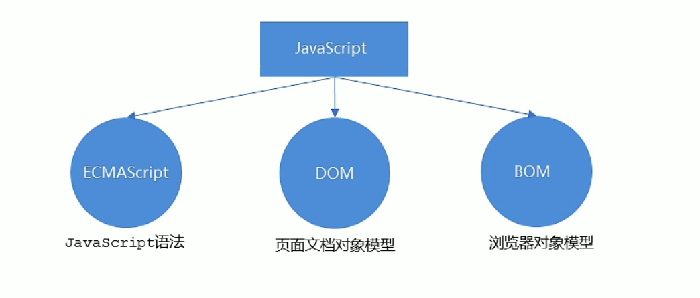
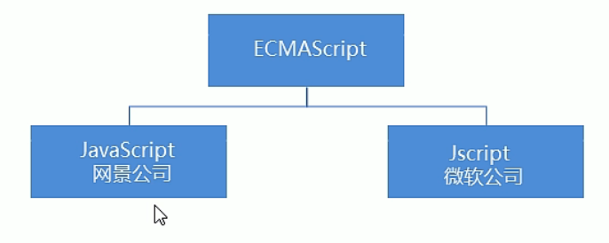

## 浏览器执行JS得过程

浏览器分成两部分：渲染引擎和JS引擎

- 渲染引擎：用来解释HTML与CSS，俗称“内核”，比如chrome浏览器得blink，老版本得webkit
- JS引擎：也称为JS解释器。用来读取网页中得JavaScript代码，队其处理后运行，比如chrome浏览器得V8

浏览器本身并不会执行JS代码，而是通过内置JavaScript引擎（解释器）来执行JS代码。JS引擎执行代码时逐行解释每一句源码（转换为机器语言），然后由计算机执行，所以JavaScript语言归为脚本语言，会逐行解释执行。

## JS得组成

1.ECMAScript

ECMAScript是由ECMA国际（原欧洲州计算机制造商协会）进行标准化的门编程语言，这种语言在万维网上应用广泛，它往往被称为JavaScript或JScript,但实际上后两者是ECMAScript语言的实现和扩展。

ECMAScript:ECMAScript规定了JS的编程语法和基础核心知识，是所有浏览器厂商共同遵守的一套S语法T业标准。

