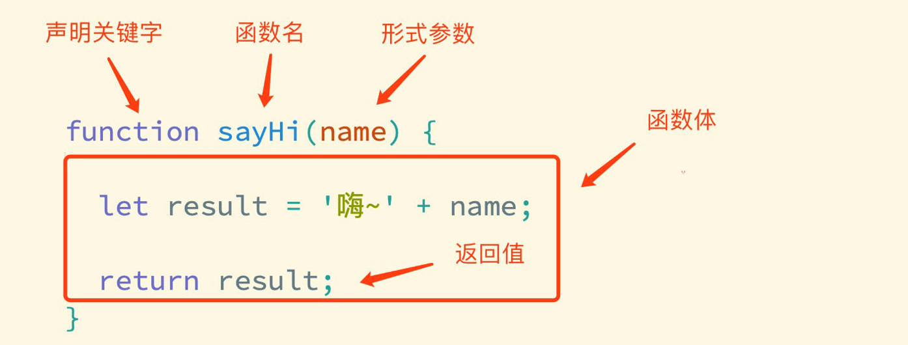
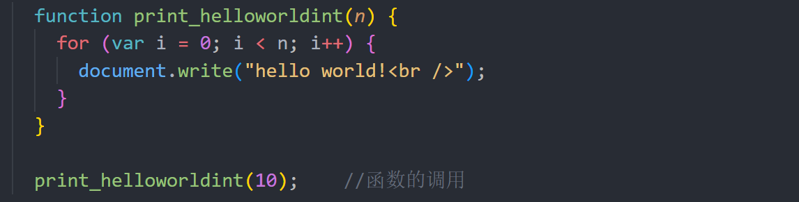
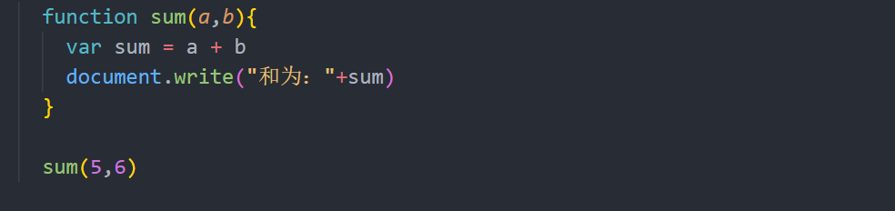

## 函数声明和调用



注意

> 函数名的命名规则与变量是一致的，并且尽量保证函数名的语义。
> 在函数中声明的变量只在该函数内可见。
> 函数也可以访问外部变量
> 函数对外部变量拥有全部的访问权限。函数也可以修改外部变量。
> 只有在没有局部变量的情况下才会使用外部变量。如果在函数内部声明了同名变量，那么函数会 遮蔽 外部变量


### 函数的举例

循环打印`hello world!`的函数

```javascript
    <script>

      function print_helloworld(n) {
        for (var i = 0; i < n; i++) {
          document.write("hello world!<br />");
        }
      }

      print_helloworld(10);
    </script>
```





求和函数

```javascript
    <script>

      function sum(a,b){
        var sum = a + b
        document.write("和为："+sum)
      }

      sum(5,6)

    </script>
```



### arguments

在每一个函数内，都有一个内置的数组，是一个变量叫做arguments。它可以存储当前函数传入的所有参数，而且是通过传参的顺序排列。

`arguments.length` 可以获取到传入参数的个数，它返回的是一个数字型

访问arguments里面的数据我们可以使用下标。

了解了上面的信息，我们可以写出下面的函数，传参的个数是不确定的，同样可以求和：

```javascript
      function num_sum() {
        var sum = 0;
        for (var i = 0; i < arguments.length; i++) {
          sum += arguments[i];
        }
        document.write("结果：" + sum);
      }

      num_sum(5, 6, 7, 9);
```


