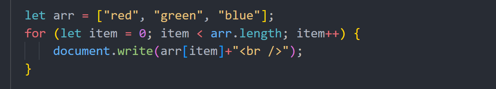
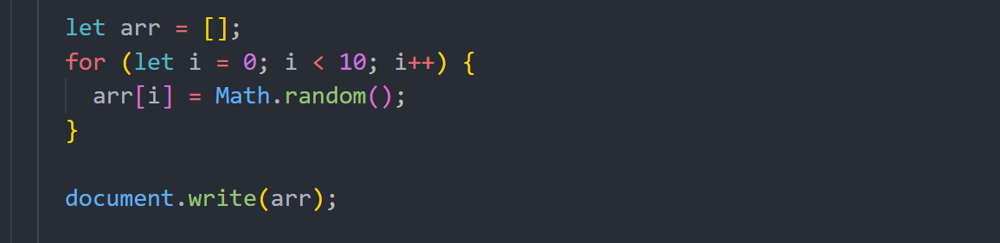
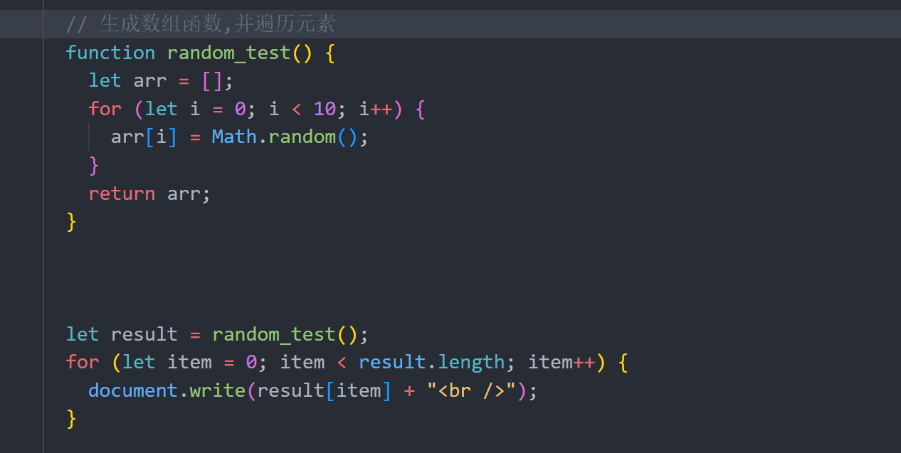

# 数组


## 数组

### 直接打印


 结果：red,green,blue 


### 数组的遍历

#### 使用for循环遍历数组

```javascript
      let arr = ["red", "green", "blue"];
      for (let item = 0; item < arr.length; item++) {
          document.write(arr[item]+"<br />");
      }
```



结果：

red
green
blue 

#### 使用for...in遍历数组

```javascript
      let arr2 = ["red2", "green2", "blue2"];
      for (let item in arr2) {
        document.write(arr2[item] + "<br />");
      }
```


结果：

red2
green2
blue2


### 随机数

`Math.random()`，可以随机0~1之间的任意数。



结果：0.1799638397748966,0.6149883520153143,0.7536069692901544,0.7299905900782,0.5422803093062489,0.5680062330112272,0.06551969586838369,0.9627034030250414,0.42357117442775327,0.3832436762761453 




结果：

0.10413324339514007
0.09519946910196153
0.7703416085634918
0.6149434149399831
0.9843939115978932
0.8453763392889626
0.496146483071801
0.48926160957772313
0.7649079270528014
0.8328335786463128