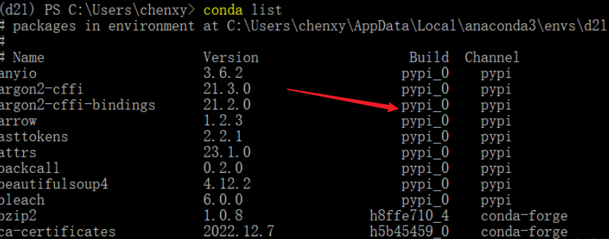

# Anaconda的详解


## 1.Anaconda安装

Anaconda是一个强大的开源数据科学平台,它将很多好的工具整合在一起，极大地简化了使用者的工作流程，并能够帮助使用者解决一系列数据科学难题。

有小伙伴纠结先安装python还是安装anaconda，这边的建议是装anaconda，就不需要单独装python了，因为anaconda自带python，且安装了anaconda之后，默认python版本是anaconda自带的python版本。


==安装前必须彻底卸载python，删除python的环境变量==


清华镜像站下载：https://repo.anaconda.com/archive/

我用的版本：Anaconda3-2024.06-1-Windows-x86_64


安装过程NEXT一直到完成，但是过程比较慢，可能在<span style="background-color:#7FFF00;">15分钟左右</span>，这个时候你可以干别的事情，但是千万不要怀疑他卡死了，把他关掉！需要耐心等待！


### 添加环境变量

```
D:\APP\anaconda3
D:\APP\anaconda3\Scripts
D:\APP\anaconda3\Library\bin
D:\APP\anaconda3\Library\mingw-w64\bin
```

查看版本

```
PS C:\Users\Anita> conda --version
conda 24.7.1
```

查看配置

```
(base) C:\Users\Anita>conda config --show
add_anaconda_token: True
add_pip_as_python_dependency: True
aggressive_update_packages:
  - ca-certificates
  - certifi
  - openssl
太长了省略 。。。。。。
```

### conda源修改

```
#设置清华镜像
conda config --add channels https://mirrors.tuna.tsinghua.edu.cn/anaconda/pkgs/free/
conda config --add channels https://mirrors.tuna.tsinghua.edu.cn/anaconda/pkgs/main/
conda config --add channels https://mirrors.tuna.tsinghua.edu.cn/anaconda/cloud/conda-forge/
```

注意：不支持一键复制粘贴，只能一行一行粘贴。


## Conda的命令

### 更新conda

```
conda update Anaconda
```

###  查询某个命令的帮助

```
conda create --help 
```


## 虚拟环境的管理

### 创建虚拟环境

```
conda create -n pycharm_env python=3.9
```

默认会创建到`C:\Users\***\.conda\envs\`，长期C盘会满.

添加环境到指定目录

```
conda create --prefix D:\APP\anaconda3\envs\pycharm_env python=3.9
```

==需要注意的是：CMD要以管理员身份运行==，不然你会报错，报错的原因是没有权限：

```
CondaError: Unable to create prefix directory 'D:\APP\anaconda3\envs\pycharm_env'.
```

创建过程如下：

```
Microsoft Windows [版本 10.0.19045.4651]
(c) Microsoft Corporation。保留所有权利。

C:\WINDOWS\system32>conda create --prefix D:\APP\anaconda3\envs\pycharm_env python=3.9
Channels:
 - defaults
Platform: win-64
Collecting package metadata (repodata.json): done
Solving environment: done

## Package Plan ##

  environment location: D:\APP\anaconda3\envs\pycharm_env

  added / updated specs:
    - python=3.9


The following NEW packages will be INSTALLED:

  ca-certificates    pkgs/main/win-64::ca-certificates-2024.7.2-haa95532_0
  openssl            pkgs/main/win-64::openssl-3.0.14-h827c3e9_0
  pip                pkgs/main/win-64::pip-24.0-py39haa95532_0
  python             pkgs/main/win-64::python-3.9.19-h1aa4202_1
  setuptools         pkgs/main/win-64::setuptools-72.1.0-py39haa95532_0
  sqlite             pkgs/main/win-64::sqlite-3.45.3-h2bbff1b_0
  tzdata             pkgs/main/noarch::tzdata-2024a-h04d1e81_0
  vc                 pkgs/main/win-64::vc-14.40-h2eaa2aa_0
  vs2015_runtime     pkgs/main/win-64::vs2015_runtime-14.40.33807-h98bb1dd_0
  wheel              pkgs/main/win-64::wheel-0.43.0-py39haa95532_0


Proceed ([y]/n)? y


Downloading and Extracting Packages:

Preparing transaction: done
Verifying transaction: done
Executing transaction: done
#
# To activate this environment, use
#
#     $ conda activate D:\APP\anaconda3\envs\pycharm_env
#
# To deactivate an active environment, use
#
#     $ conda deactivate


C:\WINDOWS\system32>
```

创建成功，我们查看一下

### 查看虚拟环境

```
(base) C:\Users\Anita>conda env list
# conda environments:
#
pycharm_env              C:\Users\Anita\.conda\envs\pycharm_env
base                  *  d:\APP\anaconda3
```

星号的位置表示我现在在base环境下工作。

### 激活虚拟环境

使用如下命令即可激活创建的虚拟环境。

```
conda activate env_name
```

此时使用python --version可以检查当前python版本是否为所想要的（即虚拟环境的python版本）。

```
conda deactivate
```

让你回到base环境

### 删除虚拟环境

```
(base) C:\Users\Anita>conda remove --name pycharm_env --all

Remove all packages in environment C:\Users\Anita\.conda\envs\pycharm_env:


## Package Plan ##

  environment location: C:\Users\Anita\.conda\envs\pycharm_env


The following packages will be REMOVED:

  ca-certificates-2024.7.2-haa95532_0
  openssl-3.0.14-h827c3e9_0
  pip-24.0-py39haa95532_0
  python-3.9.19-h1aa4202_1
  setuptools-72.1.0-py39haa95532_0
  sqlite-3.45.3-h2bbff1b_0
  tzdata-2024a-h04d1e81_0
  vc-14.40-h2eaa2aa_0
  vs2015_runtime-14.40.33807-h98bb1dd_0
  wheel-0.43.0-py39haa95532_0


Proceed ([y]/n)? y

Preparing transaction: done
Verifying transaction: done
Executing transaction: done
Everything found within the environment (C:\Users\Anita\.conda\envs\pycharm_env), including any conda environment configurations and any non-conda files, will be deleted. Do you wish to continue?
 (y/[n])? y
```


如果只删除虚拟环境中的某个或者某些包则是：

```
conda remove --name env_name  package_name
```


## 包（Package）的管理

### 查询已安装的包

```
conda list
```

查询当前Anaconda repository中是否有你想要安装的包

```
conda search package_name
```

查询是否有安装某个包

用conda list后跟package名来查找某个指定的包是否已安装，而且支持*通配模糊查找。

```
(base) C:\Users\Anita>conda list sys
# packages in environment at d:\APP\anaconda3:
#
# Name                    Version                   Build  Channel
m2-msys2-runtime          2.5.0.17080.65c939c               3
msys2-conda-epoch         20160418                      1
```

当然如果你确认是否有某个包的目的是要对其进行更新的话，那就直接执行conda update pkgname即可

```
conda update pkgname
```

如果该包没有安装的话，conda会报告PackageNotInstalledError错误（然后改用conda install即可）

### 包的安装和更新

```
conda install package_name
conda install numpy=0.20.3   //指定版本
conda update numpy  //更新到最新版
```

### 卸载包

```
conda uninstall package_name
```

这样会将依赖于这个包的所有其它包也同时卸载。如果不想删除依赖其当前要删除的包的其他包：

```
conda uninstall package_name --force
```

但是并不建议用这种方式卸载，因为这样会使得你的环境支离破碎，如以下（conda manual  description原文）所述：

一个直观的理解就是，如果一个包A被删除了，而依赖于它的包B、C等却没有删除，但是那些包其实也已经不可用了。另一方面，之后你又安装了A的新版本，而不幸的是，B、C却与新版本的A不兼容因此依然是不可用的。

### 清理缓存

```
conda clean -p      # 删除没有用的包 --packages
conda clean -t      # 删除tar打包 --tarballs
conda clean -y -all # 删除所有的安装包及cache(索引缓存、锁定文件、未使用过的包和tar包)
```

  conda就像个守财奴一样，把每个历史安装包都会好好保存。。。好处是可以很方便地恢复到旧的历史版本，坏处是占内存空间。。。前两天由于安装一个新的包，系统报告“CondaMemoryError: The conda process ran out of memory. Increase system memory and/or try again.”，执行"conda -y -all"清除了约30G的空间！


## conda install 和 pip install的区别 

- conda可以管理非python包，pip只能管理python包。
- conda自己可以用来创建环境，pip不能，需要依赖virtualenv之类的。
- conda安装的包是编译好的二进制文件，安装包文件过程中会自动安装依赖包；pip安装的包是wheel或源码，装过程中不会去支持python语言之外的依赖项。
- conda安装的包会统一下载到一个目录文件中，当环境B需要下载的包，之前其他环境安装过，就只需要把之间下载的文件复制到环境B中，下载一次多次安装。pip是直接下载到对应环境中。
- conda只能在conda管理的环境中使用，例如比如conda所创建的虚环境中使用。pip可以在任何环境中使用，在conda创建的环境 中使用pip命令，需要先安装pip（conda install pip ），然后可以 环境A 中使用pip 。conda 安装的包，pip可以卸载，但不能卸载依赖包，pip安装的包，只能用pip卸载。

### 安装在哪里？

conda install xxx
这种方式安装的库都会放在anaconda3/pkgs目录下，这样的好处就是，当在某个环境下已经下载好了某个库，再在另一个环境中还需要这个库时，就可以直接从pkgs目录下将该库复制至新环境而不用重复下载。

pip install xxx

分两种情况，一种情况就是当前conda环境的python是conda安装的，和系统的不一样，那么xxx会被安装到anaconda3/envs/current_env/lib/python3.x/site-packages文件夹中，如果当前conda环境用的是系统的python，那么xxx会通常会被安装到~/.local/lib/python3.x/site-packages文件夹中 

### 如何判断conda中某个包是通过conda还是pip安装的？
执行​ conda list ，用pip安装的包显示的build项目为pypi。




## Anaconda配置Pycharm环境

看这一片就够了：超详细的Anaconda(python)环境配置及pycharm专业版安装教程，适合完全零基础学习！！

https://www.bilibili.com/video/BV1ao4y1E7Vm/?spm_id_from=333.880.my_history.page.click&vd_source=9dc23d072b0edbf78ffed52f1fcb2318


## Anaconda安装jupyter

Anaconda安装的jupyter在哪？jupyter_notebook

```
(base) C:\WINDOWS\system32>jupyter notebook  --generate-config
Overwrite C:\Users\Anita\.jupyter\jupyter_notebook_config.py with default config? [y/N]y
是否要覆盖配置，这条命令当你配置完成之后就不要在执行了

Writing default config to: C:\Users\Anita\.jupyter\jupyter_notebook_config.py
```

创建

```
conda create --prefix D:\APP\anaconda3\envs\jupyter_notebook python=3.9
```

激活

```
conda activate jupyter_notebook
```

安装jupyter_notebook

```
conda install -c conda-forge notebook
```

启动

```
jupyter notebook --notebook-dir "D:\code"
```

汉化补丁

```
conda install jupyterlab-language-pack-zh-CN
```

安装语法高亮

```
conda install jupyter_contrib_nbextensions
```

遇到的问题是jupyterlab有高亮，notebook没有！！

更新

```
conda update notebook
```

制作快捷方式

进入到目录：D:\APP\anaconda3\envs\jupyter_notebook\Scripts，创建run.bat文件，内容写：

```
jupyter notebook --notebook-dir "D:\code"
```

保存，发送快捷方式到桌面即可。用得时候双击桌面快捷即可。

疑问：插入的图片放在哪里？

删除包

```
conda uninstall jupyter notebook
```

删除环境

```

conda remove --name jupyter_notebook --all
```


插件安装和一些心得

lsp 该插件用于自动补全、参数建议、函数文档查询、跳转定义等。
drawio  绘图插件


https://blog.csdn.net/weixin_44824428/article/details/128973420